<!-- ========================================
     Seção 1 — Hero / Cabeçalho
     ======================================== -->

# ralfdiass

[;Construindo+automa%C3%A7%C3%B5es+inteligentes)](https://git.io/typing-svg)

---

<!-- ========================================
     Seção 2 — Sumário Navegável
     ======================================== -->

## 📋 Sumário

- [Sobre Mim](#-sobre-mim)
- [Trajetória Profissional](#-trajetória-profissional)
- [Certificações](#-certificações)
- [Stack Tecnológica](#%EF%B8%8F-stack-tecnológica)
- [Áreas de Atuação](#-áreas-de-atuação)
- [Projetos em Destaque](#-projetos-em-destaque)
- [Estatísticas do GitHub](#-estatísticas-do-github)

---

<!-- ========================================
     Seção 3 — Sobre Mim
     ======================================== -->

## 👋 Sobre Mim

Profissional de TI com mais de **18 anos de carreira**, atualmente atuando como **Analista de Campo na Motorola Solutions** em Salvador-BA. Especializado em infraestrutura, suporte técnico de alto nível, segurança e cloud, com forte interesse em automação inteligente e integração de ferramentas de IA ao fluxo de trabalho.

🎓 Superior em **Redes de Computadores** pela Universidade Católica de Salvador  
🎯 Foco atual em **Cloud, IA, Infraestrutura e Segurança**  
🚀 Construindo projetos abertos para a comunidade

---

<!-- ========================================
     Seção 4 — Trajetória Profissional
     ======================================== -->

## 💼 Trajetória Profissional

### 🔹 Motorola Solutions · Analista de Campo
**📅 Out/2024 — Atual · Salvador, BA**

Atuação com sistemas de rádio Trunked, manutenção preventiva e corretiva, instalação e configuração de rádios móveis e portáteis, análise de falhas e suporte direto ao cliente. Elaboração de relatórios técnicos e ordens de serviço.

### 🔹 Stefanini Brasil · Team Lead Manager + Senior Support Analyst
**📅 Jan/2023 — Out/2024 · Salvador, BA**

Coordenação de equipe técnica e gestão de incidentes alinhada ao framework **ITIL**, com governança de TI baseada em ServiceNow. **Contribuição direta na redução de até 95% nos erros de execução** e no aumento do controle de incidentes. Atendimento on-site na Refinaria Acelen.

### 🔹 Avanade · Analyst Field Service Sênior
**📅 Mai/2022 — Ago/2023 · Candeias, BA**

Integrante da equipe técnica responsável pela criação e suporte da nova infraestrutura de TI no processo de **handover da privatização da Refinaria Landulpho Alves** — primeira refinaria estatal da Petrobras a ser privatizada. Suporte avançado em laboratórios de análise de gás e petróleo.

> 💡 Veja [meu LinkedIn](https://www.linkedin.com/in/ralfdias/) para a trajetória completa (8 empresas, desde 2008).

---

<!-- ========================================
     Seção 5 — Certificações
     ======================================== -->

## 🏆 Certificações

### Microsoft Fundamentals

### Outras

🔗 [**Ver lista completa de certificações no LinkedIn →**](https://www.linkedin.com/in/ralfdias/details/certifications/)

---

<!-- ========================================
     Seção 6 — Stack Tecnológica
     ======================================== -->

## 🛠️ Stack Tecnológica

### 🔸 Linguagens

### 🔸 Frameworks & Bibliotecas

### 🔸 Cloud & Infraestrutura

### 🔸 Ferramentas & Hardware

> 📚 Atualmente estudando: **Angular, React, Pandas avançado, SQL avançado, jQuery**

---

<!-- ========================================
     Seção 7 — Áreas de Atuação
     ======================================== -->

## 🎯 Áreas de Atuação

<table>
  <tr>
    <td align="center" width="25%">
      <h3>📡</h3>
      <b>Trunked Radio</b> 
      Sistemas de rádio Motorola, instalação, configuração e análise de falhas em campo
    </td>
    <td align="center" width="25%">
      <h3>🤖</h3>
      <b>Automação com IA</b> 
      Integração de ferramentas de IA para otimização de fluxos de trabalho e geração de scripts
    </td>
    <td align="center" width="25%">
      <h3>☁️</h3>
      <b>Cloud Computing</b> 
      Microsoft Azure, infraestrutura como código, monitoramento de custos e VPS
    </td>
    <td align="center" width="25%">
      <h3>🔒</h3>
      <b>Infraestrutura & Segurança</b> 
      Suporte de alto nível, ITIL, ServiceNow, hardening de servidores e compliance
    </td>
  </tr>
</table>

---

<!-- ========================================
     Seção 8 — Projetos em Destaque
     ======================================== -->

## 🚀 Projetos em Destaque

| Projeto | Status | Descrição |
|---------|--------|-----------|
| 🔍 **[Buscador de Arquivos Avançado](https://github.com/ralfdiass/buscador-arquivos-avancado)** | ✅ Concluído | Ferramenta de busca de palavras-chave em múltiplos formatos com GUI e processamento paralelo |
| ☁️ **[Azure Cost Monitor](https://github.com/ralfdiass/azure-cost-monitor)** | 🚧 Em desenvolvimento | Monitoramento e controle de custos do Azure com relatórios automáticos *(MVP: jul/2026)* |
| 🤖 **[IA Script Generator](https://github.com/ralfdiass/ia-script-generator)** | 🚧 Em desenvolvimento | Geração de scripts de automação via IA com arquitetura multi-provedor *(MVP: ago/2026)* |

---

<!-- ========================================
     Seção 9 — Estatísticas do GitHub
     ======================================== -->

## 📊 Estatísticas do GitHub

---

<!-- ========================================
     Seção 10 — Frase de Encerramento
     ======================================== -->

### 💭 *"Conhecimento se constrói. Compartilhe-o."*

---

<!-- ========================================
     Seção 11 — Contador de Visualizações
     ======================================== -->

Made with ❤️ by Rafael Dias | 2026

